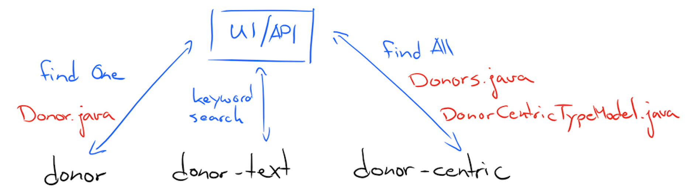

# Portal Data Model

## Models
`org.icgc.dcc.portal.model`

This package contains the Model classes that represent our Data Model.
These classes are populated with the information from the results of Elasticsearch queries. Furthermore, 
these classes are all serializable to JSON for use in creating responses in the Resource classes. 

There are two main groups of classes here. Those that represent individual entities, and those that 
represent a collection of entites. 

### Paginated
The model classes representing collections of entites all extend from the `Paginated` class. This abstract
class provides functionality for holding and setting information about the pagination of the results as well
as the information about the facets (aggregations). 

The facet information is stored in a Map. 
```java
 private Map<String, TermFacet> facets
 ```

The pagination information is stored in a `Pagination` object that holds information about the following:
* count
* total
* size
* from
* sort
* order
* page
* pages

Using donors as an example:


## Elasticsearch Documents to Models

### Entities
From a user's point of view, you can think of entities as the basic basic building block
of the Portal's data model.

Things like donors and genes, and mutations are entities, and for the end user, each entity has a
corresponding entity page. Some examples:
* https://dcc.icgc.org/donors/DO222843
* https://dcc.icgc.org/genes/ENSG00000155657
* https://dcc.icgc.org/mutations/MU62030
* https://dcc.icgc.org/projects/BRCA-US

Each entity type has a corresponding model class and Elasticsearch document type. 

For example the Donor Model, has a `donor` type in Elasticsearch: [donor.json](https://github.com/icgc-dcc/dcc-etl/blob/develop/docs/schemas/donor.json).
The class `org.icgc.dcc.portal.model.Donor` is the model class for this entity. 

### Searching and Text Types
All entities that can be searched through the Keyword Search have a corresponding analyzed 
version of their Elasticsearch documents. This documents have the suffix `-text`.

Following the donor example from the previous section, there exists a `donor-text` document type. The schema
is as follows: [donor-text.json](https://github.com/icgc-dcc/dcc-etl/blob/develop/docs/schemas/donor-text.json).

These `-text` types allows us to leverage Elasticsearch's text search capabilities to quickly retrieve matches
based on user input.

### Advanced Search, Centric Types, and the Type Model

In advanced search and a few other places where we need to perform queries that essentially perform joins on entities. 
The queries run through the PQL infrastructure and use the `-centric` document types. These documents are prejoined
documents with the primary entity as the root. 

For example `donor-centric` documents have the `donor` entity as the root document with `gene` and `project` as nested
child documents. 

Every `-centric` type must have a corresponding `TypeModel` class. For the `donor-centric` document type, we have 
`DonorCentricTypeModel`. All the `TypeModel` classes are in the package `org.dcc.portal.pql.meta`. For more information
about the `TypeModel` refer to the [PQL](../dcc-portal-pql/PQL.md) documentation.

The results of these centric queries are used to populate the model classes that extend `Paginated`. 
In the donors examples, the model class responsible is `org.icgc.dcc.portal.model.Donors`. 

## The Big Picture
For more information about the structure of the Elasticsearch documents, 
please refer to [SCHEMAS](https://github.com/icgc-dcc/dcc-etl/blob/develop/SCHEMAS.md)
from the ETL documentation.



## Additional Reading
 
* [UI](../dcc-portal-ui/UI.md)
* [API](../dcc-portal-api/API.md)
* [PQL](../dcc-portal-pql/PQL.md)

## Useful Links

* [Elasticsearch](https://www.elastic.co/products/elasticsearch)
* [DCC Documentation](http://docs.dcc.icgc.org/)