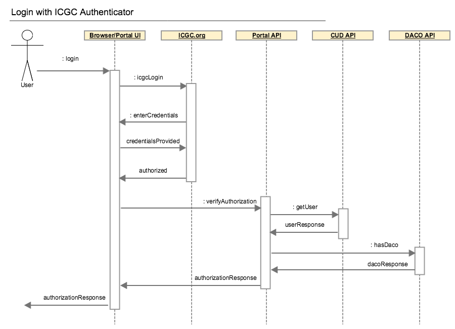

# Portal Security
## Overview

This document describes the Authentication/Authorization(A/A) process in ICGC DCC Portal.

DCC Portal has A/A services to protect controlled analysis data.

Before accessing controlled data from the International Cancer Genome Consortium (ICGC) users must get authorization from the Data Access Compliance Office ([DACO](https://icgc.org/daco)). Approved users can access the controlled data [of ICGC data releases](https://dcc.icgc.org/releases).

User can be authenticated either with icgc.org, or OpenID (Google account and Yahoo account).

An ICGC account could be created on the [ICGC web site](https://icgc.org/user/login).

ICGC.org and Google accounts are authorized with the ICGC authenticator which provides single sign-on capabilities.

DCC Portal serves data over HTTPS. In order to serve over HTTPS a valid CA SSL certificate is required. Furthermore, the certificate must be on a DNS subdomain of icgc.org for SSO login to function properly. In order for data synchronization and authentication to function properly, the target environment must be able to access the ICGC DCC Portal and OICR servers (e.g. CUD API).

HTTPS cookies are used to carry user authentication information between requests. The cookies are valid for the whole icgc.org domain. This means when a user navigates in the icgc.org domain and its subdomains the authentication cookies available to all the system and they may authorize access to their resources based on the ICGC cookies.

#### Terminology

 - DACO - Data Access Compliance Office.
 - CUD - Central User Directory
 - CMS - Content Management System

## Actors

This section contains an overview of the actors involved in different authentication scenarios and their configuration requirements.

#### Browser / Portal UI
An user's `browser`/`Portal UI` send requests to ICGC and Google authenticators, prompts user to enter the username/password and sends requests to the verification endpoint of the ICGC authenticator.

Portal UI has controls which allow to initiate log-in or log-out flows.

Portal UI uses `dcc-portal-service/conf/application.yml` to get redirect URLs for the ICGC.org and Google providers. Configuration options are `crowd.ssoUrl` and `crowd.ssoUrlGoogle`.

#### Portal API
Portal API grants access to the to the restricted data based on user's authorization. It stores authorized users information, shares it between portal instances so user's requests could be servers from any portal server in the cluster; and communicates with the DCC download server get download data which is available to user.

Additionally Portal API performs authentication with the Yahoo authentication provider.

Portal API uses cookies(more details below) from a requests and maps them either to an existing portal session or verifies them with icgc.org authenticator.

Users should define the following configuration parameters in the `application.yml`

```yaml
# ICGC Client configuration
icgc:

  # CGP/DACO API endpoint
  cgpUrl:

  # CUD API endpoint
  cudUrl: "https://icgc.org/ud_rest/1"

  # CMS API endpoint
  cmsUrl: "https://icgc.org/cms_oauth_coop/1"

  # CUD credentials.
  cudAppId:
  cudUser:
  cudPassword:

  # OAuth credentials
  consumerKey:
  consumerSecret:
  accessToken:
  accessSecret:
```

How to configure a connection with the ICGC.org authenticator is described in the next section.

#### ICGC.org
ICGC.org is an authentication provider which can authenticate ICGC users and provides APIs for users authorization and authentication. 

ICGC.org is a single sign-on provider for the icgc.org. After an authentication with the provider it sets a cookie which is valid across the `icgc.org` domain(described below).

ICGC.org provider exposes `DACO`, `CUD` and `CMS` APIs which are used for users authentication/authorization. The endpoints are protected with the `Basic` authentication or `OAuth1`. Before using the APIs a service account and and `OAuth1` credentials must be obtained from the ICGC Web team. Additionally IP filter is installed to protect the endpoints, ICGC.org provider clients must allow access to ICGC.org API from the IP addresses where the client software is installed.

To 'whitelist' client's service, login with icgc.org credential to [www.icgc.org](www.icgc.org); go to 'Your account' in the top right corner; on the 'OAuth settings' tab in the 'IP White List' form enter the server IP addresses where the DCC Portal is installed.

 - `DACO` API is queried to find information abound `DACO`-approved users. It's protected with `OAuth1`. For more information check [ICGC API documentation](https://wiki.oicr.on.ca/display/icgcweb/ICGC.org+APIs+v2.0)

 - If a user was authenticated with the Google authentication provider via the ICGC.org authenticator the ICGC.org authenticator sets a cookie which contains user's token. Name of the cookie depends of the ICGC.org authenticator's installation environment (e.g. `DEV` or `PROD`). `CMS` API is used to get name of the cookie to be used in this environment as well to retrieve user information by session token. The API is `OAuth1` protected. For more information check [CMS API documentation](https://wiki.oicr.on.ca/display/icgcweb/CMS+APIs+v1.0).

 - If a user was authenticated with icgc.org credential `CUD` API is used to retrieve user information by `CUD` session token. This API is protected with the `Basic` auth. More info could be found on the [API documentation page](https://wiki.oicr.on.ca/display/icgcweb/CUD+APIs+v1.0).

## Cookies

Cookies are used to carry authenticated user information. Portal has the following cookies which are set depending on the current auth state:

`dcc_portal_token` - this cookie is set by the portal itself after verification that the user has DACO access. The cookie is replicated between portals with Hazelcast, an in-memory shared storage.

`crowd.token_key` - This cookie is generated by icgc.org authenticator when an user was authenticated with the icgc.org credentials. Value of the cookie is a session token. Information about session could be retrieved 

There is one more cookie which is generated by icgc.org OpenID authenticator. It's name is not known in advance and depends on environment, but its name is similar to `SESSbb325adb9a2be47a42c1c28d04e380cb`. The first step when portal starts is to query the login API and get the name of the cookie.

--
List and describe the various cookies used by the system (there are 3 I think), their name and under what domain they are written and for how long they are good for. 

## Flows

#### ICGC Login


 1. `User` hits the 'login with ICGC' button. 
 2. A request is sent by the `Browser` to `ICGC.org` authenticator. The request contains an URL where the user should be redirected in case of the successful authentication. E.g. `https://icgc.org/user?continue=https://local.dcc.icgc.org:8443/`
 3. `ICGC.org` prompts for the user's credentials.
 4. `User` enters credential.
 5. If the credentials are valid `ICGC.org` creates a `crowd.token_key` cookie which contains session token for the authenticated user.
 6. `Browser` sends a user verification request to the `Portal API`. The request contains the cookie set in the previous step.
 7. `Portal API` gets session token from the cookie and sends a getUser request to the `CUD API`.
 8. If user's session is still active the `CUD API` responds with an user details associated with the session token.
 9. `Portal API` uses OpenID account from the user details and send a hasDaco request to the `DACO API`.
 10. The `DACO API` responds if the OpenID account is a DACO authorized account.
 11. `Portal API` creates local representation of the user, which contain DACO authorization information, Collaboratory cloud access information, username and a random session identifier; stores the representation in the Hazelcast storage which is shared among all the portal instances; sets `dcc_portal_token` cookie which contain DCC portal session which was just created and send the response back to the `Browser`.
 12. `Browser` refreshes and displays user's authentication/authorization information to the `User`.

#### Google Login


 1. `User` hits the 'login with Google' button. 
 2. A request is sent by the `Browser` to `ICGC.org` authenticator. The request contains an URL where the user should be redirected in case of the successful authentication. E.g. `https://icgc.org/user?continue=https://local.dcc.icgc.org:8443/`
 3. `ICGC.org` responds with a redirect request to the `Google Authenticator` to the `Browser`.
 4. `Browser` sends an authentication request to the `Google Authenticator` and an URL where it should be redirected in case of success(`ICGC.org`).
 4. `User` enters credential.
 5. If the credentials are valid the `Browser` is redirected to `ICGC.org`.
 6. `ICGC.org` creates a CMS cookie(one which looks like `SESSbb325adb9a2be47a42c1c28d04e380cb `)  which contains session token for the authenticated user.
 6. `Browser` sends a user verification request to the `Portal API`. The request contains the cookie set in the previous step.
 7. `Portal API` gets session token from the cookie and sends a getUser request to the `CMS API`.
 8. If user's session is still active the `CMS API` responds with an user details associated with the session token.
 9. `Portal API` uses OpenID account from the user details and send a hasDaco request to the `DACO API`.
 10. The `DACO API` responds if the OpenID account is a DACO authorized account.
 11. `Portal API` creates local representation of the user, which contain DACO authorization information, Collaboratory cloud access information, username and a random session identifier; stores the representation in the Hazelcast storage which is shared among all the portal instances; sets `dcc_portal_token` cookie which contain DCC portal session which was just created and send the response back to the `Browser`.
 12. `Browser` refreshes and displays user's authentication/authorization information to the `User`.

#### Yahoo Login


 1. `User` hits the 'login with Yahoo' button. 
 2. A request is sent by the `Browser` to the `Portal API` authenticator. 
 3. `Portal API` creates a session token for the user; creates an authorization request to the `Yahoo Authenticator`; and stores in a session ID to the redirect request association in a temporary storage. `Portal API` responds with a redirect request to the `Yahoo Authenticator` to the `Browser`.
 4. `Browser` sends an authentication request to the `Yahoo Authenticator` and an URL where it should be redirected in case of success(`Portal API`).
 5. `User` enters credential.
 6. If the credentials are valid the `Browser` is redirected to `Portal API`.
 7. `Portal API` retrieves user's session token from the request. Uses it to get the authentication request from the temporary storage. Verifies with the `Yahoo Authenticator` that the user was authenticated. Get the user's OpenID from the response and send a hasDaco request to the `DACO API`.
 8. The `DACO API` responds if the OpenID account is a DACO authorized account.
 9. `Portal API` creates local representation of the user, which contain DACO authorization information, Collaboratory cloud access information, username and a random session identifier; stores the representation in the Hazelcast storage which is shared among all the portal instances; sets `dcc_portal_token` cookie which contain DCC portal session which was just created and send the response back to the `Browser`.
 10. `Browser` refreshes and displays user's authentication/authorization information to the `User`.

#### Logout

 1. `User` hits the 'Logout' button.
 2. `Browser` sends a logout request to the `Portal API`.
 3. `Portal API` removes the user from the Hazelcast shared storage and responds to the `Browser` with a request to delete all the before-mentioned cookies.
