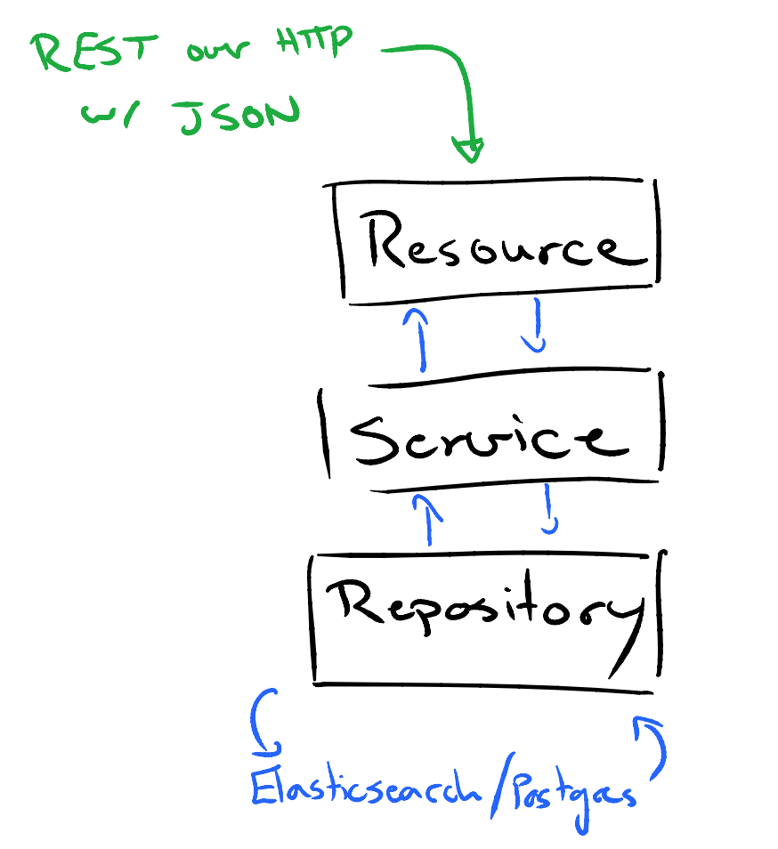

# Data Portal API

1. [Indended Audience](#indended-audience)
2. [Learning Objectives](#learning-objectives)
3. [Terms](#terms)
4. [Portal Architecture and the API](#portal-architecture-and-the-api)
5. [Data Store](#data-store)
 1. [Elasticsearch](#elasticsearch)
 2. [Postgres](#postgres)
6. [Query Languages](#query-languages)
7. [Frameworks and Libraries](#frameworks-and-libraries)
 1. [Dropwizard](#dropwizard)
 2. [Spring](#spring)
 3. [Lombok](#lombok)
 4. [JUnit](#junit)
 5. [Swagger](#swagger)
 6. [Elasticsearch](#elasticsearch)
8. [Project Organization](#project-organization)
 1. [Preface](#preface)
 2. [Basics](#basics)
 3. [Life Cycle of a Request](#life-cycle-of-a-request)
 4. [Important Packages](#important-packages)

## Intended Audience
This document is intended for developers working on or planning on contributing to the dcc-portal
project which powers the [ICGC Data Portal](https://dcc.icgc.org).

This document will describe and document the code and architecture powering the API and offer insight 
into the overall design 

## Learning Objectives
* Awarness of the protocols in use. 
* Understanding the flow of data. From how and where a request comes in to how the data gets back out.
* Familiarity with the frameworks and technology powering the portal.
* Gaining an intuition of the behaviour of the API

## Terms
* ICGC - International Cancer Genome Consortium
* DCC - The ICGC Data Coordination Center
* JQL - JSON Query Language
* PQL - Portal Query Language
* REST - Representational State Transfer

## Portal Architecture and the API
The API module of the dcc-portal project sits between the UI and PQL infrastructure. 
State is manuplated by users using the UI and the UI sends REST requests to the API.
The API consumes these requests, performs any needed business logic, and hands off a query to the PQL
module if needed. When the PQL module returns with data, additional business logic may be performed by
the API before returning a response to the UI.


Requests between the UI and API are communicated over HTTP.

Since the API is RESTful, all requests are one of the following verbs: GET, PUT, POST, DELETE.
All responses from the API are returned in the form of JSON content. 

* For more information about REST: [Wikipedia](https://en.wikipedia.org/wiki/Representational_state_transfer)
* For more information about JSON: http://json.org/

## Data Store
There are two places from which the portal can query data.

### Elasticsearch
The main place where the data lives is in Elasticsearch. Without going into too much detail,
the data in elasticsearch lives in three indices.
* The release index, where the majority of the information lives. Stores donors, genes,
mutations, genesets, diagrams, drugs and more.
* The repository index, where the information about external files gets stored.
* The terms lookup index, where entity sets are created and stored. 

The majority of the time, data from Elasticsearch is queried through the PQL infrastructure,
except for special cases such as querying files from the repository index.

### Postgres
Metadata and state of analysis results and sets that are in flight (still being computed)
are stored here. 

## Query Languages

This section will describe the various query languages used by the API.

### JQL
JSON Query Language. JSON representation of a filter to be applied to our data model.
Primarily used by the UI to communicate the desired query to the API.

Example of JQL query where we are filtering for donors where the primary cancer site is blood,
gene type is protein coding, and functional impact is high.
```json
{"donor":{"primarySite":{"is":["Blood"]}},"gene":{"type":{"is":["protein_coding"]}},"mutation":{"functionalImpact":{"is":["High"]}}}
```

### PQL
Portal Query Language. A query language designed for our data model, meant to abstract away
the raw elasticsearch queries to a more human format. 

An example query where we want the id and age of a donor with id of 1:
```
select(id,age),facets(*),eq(donor.id,1)
```

### SQL
Structured Query Language. Used for querying Postgres. 


## Frameworks and Libraries
The dcc-portal project is build on top of a lot very useful frameworks and libraries.
They provide important functionality from lightweight HTTP servers to useful functionality 
when manipulating data. 

### Dropwizard
At the heart of the project sits Dropwizard. In addition for being responsible for bootstrapping
the application itself, Dropwizard brings many useful libraries:

#### Jetty
The library responsible for providing the Web server for the dcc-portal web application.
Handles the HTTP layer of the requests and responses to the API.

#### Jersey
Provides the RESTful web services for the API. This is the reference implementation of JAX-RS.

#### Jackson
Library for handling, parsing, and manipulating JSON objects and data.

#### Guava
Provides useful classes and methods for handling and manipulating collections among other things. 

#### SLF4J
Simple Logging Facade for Java. Handy library for providing logging functionality within the application.

### Spring
The Spring Framework is an application framework that provides us with inversion of control,
dependancy injection, and configuration utilities. 

### Lombok
Very nifty library for Java projects which aims to reduce boilerplate code by replacing
said code with annotations. 

### JUnit
The standard unit testing suite used in Java projects. 

### Swagger
A library that generates a user facing representation of the RESTful API.

### Elasticsearch
Library for querying Elasticsearch indices. This is sometimes used instead of the PQL layer for special cases
where we need to be making custom queries not easily represented in our data model or query language. 

## Project Organization

### Preface
The organization and architecture of the project is heavily influenced by the idea of Domain-Driven Design.
The term was coined by Eric Evans in his book also titled "Domain-Driven Design". 
More info: [Wikipedia](https://en.wikipedia.org/wiki/Domain-driven_design)

### Basics
Before we get started, it might be a good idea to keep the following diagram fresh in your mind.
It shows a very simplified representation of the API's core functions and flow of data:


The diagram shows the three most important packages / units of organization within the project.

* Resource (org.icgc.dcc.portal.resource)
 * The resource classes are the entry point for an incoming request. 
 * This is where all the API endpoints are defined through the annotations provided by JAX-RS.
 * Preforms basic validation on the input, such as ensuring all required parameters for a given endpoint
 contain values.
 * Basic logging of request.
 * Calls the appropriate method from the appropriate service based on the API endpoint
* Service (org.icgc.dcc.portal.service)
 * Performs business logic on input before handing off to repository class and/or performs 
 business logic on output from repository before returning back to the resource.
* Repository (org.icgc.dcc.portal.repository)
 * Responsible for constructing and executing queries and returning the data. 
 * A repository class can either be querying elasticsearch or postgres. The majority of cases
 however it is for elasticsearch. 

### Life Cycle Of A Request
A great way to understand the control flow is to follow a request from end to end. 
Our example will be the following: The API receives a GET request to the donor endpoint asking for donors where the primary cancer site is "Blood". 

The request URL is the following:
```
https://dcc.icgc.org/api/v1/donors?filters={"donor":{"primarySite":{"is":["Blood"]}}}&from=1&size=10
```

From the `/v1/donors` portion of the URL we know the entry point for this request will be in the `DonorResource.java` file. 

The method responsible for handeling the request will be:
```java
@GET
@Timed
@ApiOperation(value = RETURNS_LIST + DONOR + S, response = Donors.class)
public Donors findAll(...) {...}
```
From the request, a Query object is created and passed to a service.
In our case this is `DonorService.java`.

The method that gets called in the service is:
```java
public Donors findAllCentric(Query query, boolean facetsOnly)
```
This method converts the `query` object into PQL which our PQL infrastructure will understand, 
and based on the passed boolean the method may perform different operations. For our case, the
value of `facetsOnly` is `false`.

The service then calls the repository, which in this case is `DonorRepository.java`.

The method that gets called in the repository is:
```java
public SearchResponse findAllCentric(StatementNode pqlAst)
```
The method consumes the PQL object, executes the query, and then returns the response. 

Working back up, `DonorRepository.findAllCetric` returns a `SearchResponse` with the data, which
`DonorService.findAllCentric` converts into a collection of Donor objects, which in turn is returned
to `DonorResource.findAll` which thanks to the frameworks in play serializes this collection as JSON
and returns the response to the requesting agent. 

Requests are not always so simple, and there are cases where a resource may talk different services
based on certain conditions, and some services that can talk to different repositories. 

### Important Packages

We have covered the three most import packages, but there are others we rely on as well. Here are
other important packages to be aware of:

* Model (org.icgc.dcc.portal.model)
 * Contains the classes describing the entities and collections in our domain.
 * Models generally contain annotations for Jackson used in serialization to JSON
* Util (org.icgc.dcc.portal.util)
 * A wide range of utility classes live here. 
* Converter (org.icgc.dcc.portal.pql.converter)
 * This package contains the classes responsible from converting our JQL to PQL to be consumed by
 our query language.
* Config (org.icgc.dcc.portal.config
 * The classes here are responsible for setting the configuration of the portal. 
* Analysis (org.icgc.dcc.portal.analysis)
 * Classes that power the analysis functionality of the portal. 
 * Performing enrichment analysis.
 * Performing set operations on EntitySets. 