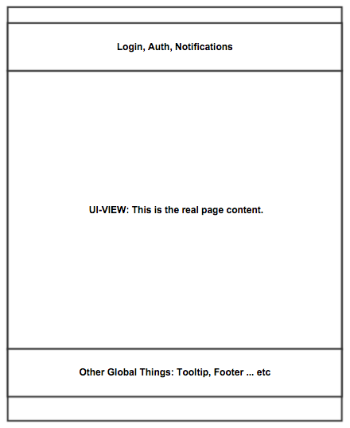

# DCC Portal Application UI Documentation #


## Who this Document is for? ##

* A developer, or team of developers who wish to understand the general frontend
components in order to extend, modify or provide fixes towards the UI.


## Learning Objectives ##

* Understand the general frameworks used within the frontend.
* Be able to identify the responsibilities of various portions of the UI codebase.
* Learn to customize the DCC Banner, Logo and Footer.
* Theming the DCC Portal frontend.
* In general, gain enough knowledge from prior sections to work on your own feature enhancements in the frontend code.


## The Frontend Stack ##

### Build ###
*Please note:* The below dependendencies are managed using the [NodeJS's](https://nodejs.org) [NPM](https://www.npmjs.com/) tool. Please
refer to the *package.json* file in the current directory to lookup which versions the portal is depending on.


* NodeJS with NPM
* Grunt Tools (NodeJS) for
 * Development
    * Connect (Grunt HTTP Server)
    * Watch (File Watcher) w/LiveReload and SASS Regeneration
 * JS Linting
   * JSHint
 * Frontend Tests
   * Karma w/PhantomJS
 * Concatenation/Minification/Source Map Generation
   * Usemin/CSSmin/HTMLmin/Imagemin
   * Concat
   * Uglify
   * Filerev
   * etc...
   * Please Refer to the Frontend *Gruntfile.js* for More Details)
* SASS Preprocessor (w/Compass) - CSS Development
* Bower (Frontend Library Package Management)
 


### UI ###
*Please note:* The below dependendencies are managed using the [Bower](http://bower.io/) package manager. Please
refer to the *bower.json* file in the current directory to lookup which versions of the illustrated libraries the portal is depending on.

* *[jQuery](https://jquery.com/)* - For DOM Manipulation it is used by various 3rd party dependencies and the application itself)
* *[lodash](https://lodash.com/)* - A Common JS utility library.
* *[AngularJS](https://angularjs.org/)* - Version 1.x.y - DCC Portal frontend's primary JS framework.
* *[Angular-ui-router](https://github.com/angular-ui/ui-router)*  - Route Management in AngularJS.
* *[Restangular](https://github.com/mgonto/restangular)* - REST Resource Management in AngularJS.
* *[Angular-bootstrap](https://angular-ui.github.io/bootstrap/)* Bootstrap integration in AngularJS.
* *[D3.js](https://d3js.org/)* - Visualization (*Preferred*) Library
* *[Highcharts](http://www.highcharts.com/)*  - Visualization Library
* *Other Various Third Party Libs*

## Frontend Breakdown ##

### UI Architecture ###

The frontend UI is based fully on an AngularJS Single Page Application ([SPA](https://en.wikipedia.org/wiki/Single-page_application)) Architecture
meaning that the core domain logic is encapsulated on the server-side while the UI logic is soley handled in the user's browser and managed via JavaScript 
(specifically [ECMAScript](https://en.wikipedia.org/wiki/ECMAScript) Version 5). Communication between the two layers is achieved using [RESTful](https://en.wikipedia.org/wiki/Representational_state_transfer) webservices.


DCC Portal UI uses the angular-ui-router to extend and replace the functionality provided by Angular's default Router implementation. UI Router makes
use of the ```ui-view``` directive to handle state transitions between views. Below is a diagram illustrating the basic template for the ui-view in the DCC Portal UI:



### File Organization ###
This section provides a high-level outline of the modules/file structure in the Portal UI project.

Folder | Purpose   | Example
------ | --------- | -------
/scripts/advanced| Advanced Page | [https://dcc.icgc.org/search](https://dcc.icgc.org/search)
/scripts/analysis | Set Analysis Page | [https://dcc.icgc.org/analysis](https://dcc.icgc.org/analysis) 
```/scripts/app``` | ```The main entry point in the application. This is the file that provides the definition of the main application module and it's dependencies.It also contains bootstrap code and some configuration for some of the dependencies (i.e. Restangular) used within the application.``` | ```N/A```
/scripts/auth | Login module | N/A
/scripts/beacon | Global alliance beacon page | [https://dcc.icgc.org/ga4gh/beacon](https://dcc.icgc.org/ga4gh/beacon)
/scripts/browser | Genome Viewer Page  | [https://dcc.icgc.org/browser](https://dcc.icgc.org/browser)
/scripts/common | Houses common angular services, filters, and other utilities that are shared among application modules. This is also the build area for the PQL grammar file. | N/A
/scripts/compounds | Drug Entity Page | [https://dcc.icgc.org/compound/ZINC000001530689](https://dcc.icgc.org/compound/ZINC000001530689)
/scripts/donors | Donor Page | N/A
/scripts/downloader | Dynamic downloader modules. Both request submitter and viewer. | N/A
/scripts/enrichment | Gene set enrichment module | N/A
/scripts/facets | Faceting modules, used in Advanced Page and Projects Page | N/A
/scripts/genelist | Upload genelist module | N/A
/scripts/genes | Gene Page. | [https://dcc.icgc.org/genes/ENSG00000141510](https://dcc.icgc.org/genes/ENSG00000141510)
/scripts/genesets | Gene Set Page. Housing Reactome, Gene-Ontology and other gene annotations. | [https://dcc.icgc.org/genesets/R-HSA-5625970](https://dcc.icgc.org/genesets/R-HSA-5625970)
/scripts/keyword | Quick text search module | N/A
/scripts/mutations | Mutation Page | N/A
/scripts/pancancer | Pancancer landing page | [https://dcc.icgc.org/pcawg](https://dcc.icgc.org/pcawg)
/scripts/pathwayviewer | Pathway Viewer Page for Reactome pathways (linked to from enrichment analysis results) | N/A
/scripts/phenotype | Phenotype analysis page | N/A
/scripts/projectmutationviewer | Project mutation viewer component. | N/A
/scripts/projects | Projects Page and Project Page | [https://dcc.icgc.org/projects](https://dcc.icgc.org/projects), [https://dcc.icgc.org/projects/BRCA-US](https://dcc.icgc.org/projects/BRCA-US)
/scripts/proteinstructureviewer | Protein structure viewer component. | N/A
/scripts/releases | Release module. Carries portal release summary. | [https://dcc.icgc.org/releases](https://dcc.icgc.org/releases)
/scripts/repositories  | Pages for cloud documentation and repository stats (AWS/Collaboratory) | N/A
/scripts/repository  | Static download Page | [https://dcc.icgc.org/repository](https://dcc.icgc.org/repository)
/scripts/sets | Set upload, set operations, set CRUD | N/A
/scripts/share | Sharing, URL shortening module | N/A
/scripts/software | DCC software page which publishes various tools for working with ICGC Data | [https://dcc.icgc.org/software](https://dcc.icgc.org/software)
/scripts/stackedareachart | Stacked bar chart UI component. | N/A
/scripts/stackedbarchart | Stacked area chart UI component. | N/A
/scripts/tokens | Token management for Collaboratory project via the portal login, not to be confused with the auth module with deals with ICGC authentication and tokens. | N/A
/scripts/ui | Mostly smaller UI components tied to the ICGC portal | N/A
/scripts/venn23 | Venn diagram UI component used in analysis module. | N/A
/scripts/visualization | Visualization module definition for the project mutation viewer, project stacked bar and area bar. | N/A
/vendor/scripts/bamiobio| Customized iobio Module | N/A
/vendor/scripts/genome-viewer | Customized genome viewer with ICGC Tracks and Data Adapters | N/A

## Getting Started - The DCC Portal UI Hello World ##

### Start Up the Development Server
1. From within the DCC Portal route go to  ```dcc-portal-ui/```
2. Ensure you have previously installed NodeJS and ran an ```npm install```
3. Start up the DCC Portal API - this will ensure that your DCC API webservices will not fail. Refer to
 the DCC-Portal-API [README.md](../dcc-portal-api/README.md) for more details.
4. Type in the command ```grunt server```
5. Open your favourite development browser at ```http://localost:9000```
6. From this point on any changes made to the application in the ```app/scripts```. Refer to the [README.md](./README.md) for more details
on starting your development server.

### Create your Angular Module Root ###

1. From within the DCC Portal route go to  ```dcc-portal-ui/app/scripts```.
2. Create a folder with your module name i.e. ```mkdir helloworld```
3. Create folders inside of ```helloworld``` called ```js```, ```views```, ```styles```, ```images```. Your folder structure should now look like the below:
```
  helloworld/
  |__ js/
  |__ views/
  |__ styles/
  |__ images/
```

:thumbsup: If you have any questions about coding conventions please refer to the Portal UI [CONTRIBUTING.md](./CONTRIBUTING.md) file for more information.

### Register your Application Route ###

:dart: Your application route is the entry point into your application. Here you will be using angular-ui-router. For more information
about this library please [refer to its documentation](https://github.com/angular-ui/ui-router/wiki).

1. In your ```js``` folder create a javascript file called ```helloworld.js```. Note that it's conventional to give it the same name as your module.
2. In your ```helloworld.js``` file you will declare your AngularJS module, include your module dependencies (if applicable), and do some general module initialization.
3. After defining your module you will then tell angular-ui-router a little about your application architecture including the url, controllers and views you would
like to use. Again please [refer to its documentation](https://github.com/angular-ui/ui-router/wiki) if you are not familiar with this library. We will provide only
the basics here. Your :paperclip: ```helloworld.js``` file might look something like this:
```javascript
(function () {
      'use strict';

      // Projects modules definition including dependencies
      angular.module('helloworld', ['helloworld.controllers', 'ui.router'])
          .constant('helloworldConstants', {
            HELLO_MSG: 'Hello DCC Portal World!', GOODBYE_MESSAGE:'Goodbye sweet world!' // CAPITALIZE AND UNDERSCORE CONSTANTS!
          })
          .config(function ($stateProvider) {
            $stateProvider.state('helloworld', {
              url: '/helloworld',
              templateUrl: 'scripts/helloworld/views/helloworld.html',
              controller: 'HelloworldCtrl as HelloworldCtrl', // <--- controller declaration!
            });
          })
          .run(function(someDependency1, someDependency2, someDependencyN) {
            /* ... Run block implementation ... */
          });

    })();
```

:question: If you are unfamiliar with the above AngularJS Framework code we suggest you refer to the
[AngularJS Documentation](https://docs.angularjs.org/guide).


### Create your Controllers, Views and Directives Skeletons. ###

Now that we defined our ```helloworld``` module let's create our corresponding AngularJS controller and view.

 :paperclip: js/controllers.js

```javascript
(function() {
  'use strict';

  // Projects modules definition including dependencies
  angular.module('helloworld')
    .controller('HelloworldCtrl', function(helloworldConstants) {
      var _controller = this,
          _greetingMsg = helloworldConstants.HELLO_MSG;


      _controller.getHelloMsg = function() {
        return _greetingMsg;
      };

      _controller.pressTheRedButton = function() {
        _greetingMsg = helloworldConstants.GOODBYE_MESSAGE;
      };
  });
})();
```

 :paperclip: views/helloworld.html

```html
    <h1 data-ng-bind="HelloworldCtrl.getHelloMsg()"></h1>
    <button data-ng-click="pressTheRedButton()" class="red-button">
        Do not press the red button...
    </button>
```

 :paperclip: styles/helloworld.scss

```scss
$topRedButtonColour: #fa8cad;
$bottomRedButtonColour: #b82b2b;

.red-button {
  background: $bottomRedButtonColour;
  background-image: linear-gradient(to bottom, $topRedButtonColour, $bottomRedButtonColour);
  border-radius: 28px;
  border-color: $topRedButtonColour;
  font-family: Arial;
  color: #fff;
  font-size: 20px;
  padding: 10px 20px 10px 20px;
  text-decoration: none;
}
```
### Registering your Module with the Portal ###

#### Update index.html ####
So far so good but we can't see our handy work yet. The next steps are to register the module with
them main application.

1. Open the ```dcc-portal-ui/scripts/app/index.html``` file and add all our script references.
Inside the ```ICGC Core Application``` build:js usemin block/

```html
<!-- --------------------------------------------------------- -->
<!-- ICGC Core Application -->
<!-- --------------------------------------------------------- -->

<!-- build:js scripts/scripts.js -->
<script src="scripts/app/js/app.js"></script>
<!-- extra js files included here... -->
<script src="scripts/helloworld/js/helloworld.js"></script>
<script src="scripts/helloworld/js/controllers.js"></script>
<!-- endbuild -->
```

2. Update the ```app/styles/styles.scss``` file and include an import to your sass file.

:paperclip: app/styles/styles.scss

```scss
@import "../../scripts/helloworld/styles/helloworld";
```
3. Add your ```helloworld``` module dependency to the ```scripts/app/js/app.js``` file.

```javascript
 var module = angular.module('icgc', [
    'ngSanitize',
    'ngAnimate',
    'ngCookies',

    // angular plugins
    'restangular',
    'ui.scrollfix',

    // More modules included here ...
    'helloworld' // <--- Define your Module Here!
    ]);
```

### Update DCC Portals Module ###

## Got Questions/Feeback? ##

 * We are always happy to help - should you have any questions or feedback
please feel free to contact us at [dcc-support@icgc.org](mailto:dcc-support@icgc.org) 
